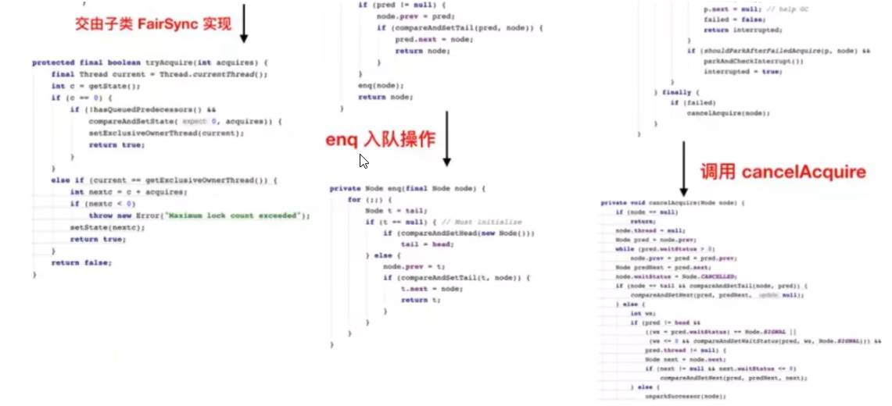
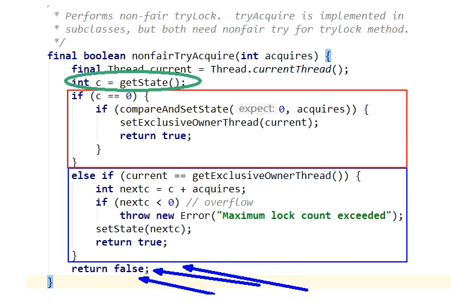

# Lock接口的实现类，基本都是通过【聚合】了一个【队列同步器】的子类完成线程访问控制的

# ReentrantLock的原理

# 从最简单的lock方法开始看看公平和非公平

可以明显看出公平锁与非公平锁的lock()方法唯一的区别就在于公平锁在获取同步状态时多了一个限制条件:

hasQueuedPredecessors()，hasQueuedPredecessors是公平锁加锁时判断等待

# 以非公平锁ReentrantLock()为例作为突破口，方法lock()

对比公平锁和非公平锁的 tryAcquire()方法的实现代码，其实差别就在于非公平锁获取锁时比公平锁中少了一个判断 hasQueuedPredecessors()

hasQueuedPredecessors() 中判断了是否需要排队，导致公平锁和非公平锁的差异如下:

公平锁：公平锁讲究先来先到，线程在获取锁时，如果这个锁的等待队列中已经有线程在等待，那么当前线程就会进入等待队列中;

非公平锁：不管是否有等待队列，如果可以获取锁，则立刻占有锁对象。也就是说队列的第一个排队线程苏醒后，不一定就是排头的这个线程获得锁，它还是需要参加竞争锁(存在线程竞争的情况下)，后来的线程可能插队夺锁了。

### lock()

### acquire

#### 源码和3大流程走向

#### tryAcquire(arg)

return false; 继续推进条件，走下一个方法

return true; 结束

#### addWaiter(Node.EXCLUSIVE)

##### enq()

双向链表中，第一个节点为虚节点(也叫哨兵节点)，其实并不存储任何信息，只是占位。真正的第一个有数据的节点，是从第二个节点开始的。

#### acquireQueued(addWaiter(Node.EXCLUSIVE), arg))

如果在红框中抢占失败，就会进入到下面蓝框中的方法

##### shouldParkAfterFailedAcquire

如果前驱节点的 waitStatus 是 SIGNAL状态，即 shouldParkAfterFailedAcquire 方法会返回 true程序会继续向下执行 parkAndchecklnterrupt 方法，用于将当前线程挂起

