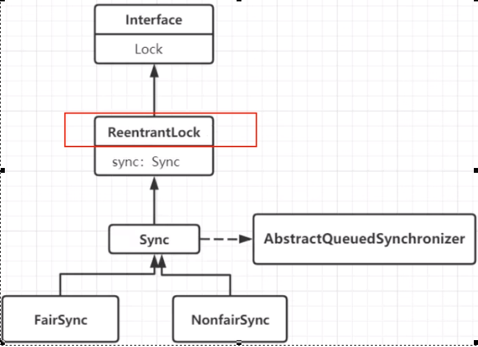
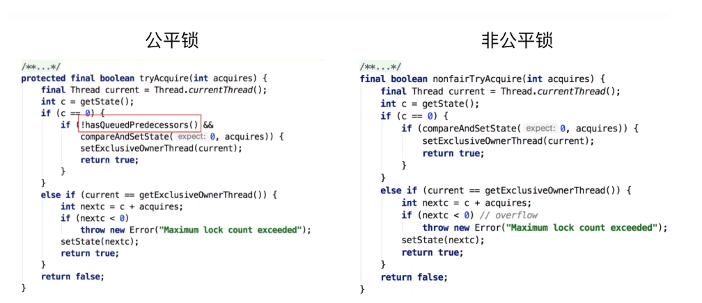

# Lock接口的实现类，基本都是通过【聚合】了一个【队列同步器】的子类完成线程访问控制的

# ReentrantLock的原理

# 从最简单的lock方法开始看看公平和非公平

可以明显看出公平锁与非公平锁的lock()方法唯一的区别就在于公平锁在获取同步状态时多了一个限制条件:

hasQueuedPredecessors()，hasQueuedPredecessors是公平锁加锁时判断等待

# 以非公平锁ReentrantLock()为例作为突破口，方法lock()

对比公平锁和非公平锁的 tryAcquire()方法的实现代码，其实差别就在于非公平锁获取锁时比公平锁中少了一个判断 hasQueuedPredecessors()

hasQueuedPredecessors() 中判断了是否需要排队，导致公平锁和非公平锁的差异如下:

公平锁：公平锁讲究先来先到，线程在获取锁时，如果这个锁的等待队列中已经有线程在等待，那么当前线程就会进入等待队列中;

非公平锁：不管是否有等待队列，如果可以获取锁，则立刻占有锁对象。也就是说队列的第一个排队线程苏醒后，不一定就是排头的这个线程获得锁，它还是需要参加竞争锁(存在线程竞争的情况下)，后来的线程可能插队夺锁了。

